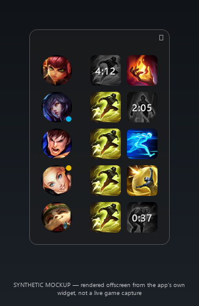

# ez-lol-spell-tracker

[](https://github.com/lucas-lima-s/ez-lol-spell-tracker/actions/workflows/ci.yml)

An injection-free League of Legends overlay that tracks enemy summoner-spell cooldowns from
Riot's local Live Client Data API.



*The image above is a synthetic render produced offline by `scripts/render_mockup.py` from the
app's own widget code, not a live game capture.*

## What it does

`ez-lol-spell-tracker` detects the current match through Riot's Live Client Data API, populates the
five enemies with their champion and equipped summoner spells, and gives you one click per spell
to start a cooldown timer anchored to the in-game clock. No game files are read or modified.

## Why it is built this way

The overlay is an external, frameless window: zero DLL injection, zero memory reads, and the app
only ever talks to the official `https://127.0.0.1:2999/liveclientdata/` endpoints (plus Riot's
Data Dragon CDN for sprites and patch data), with TLS pinned to Riot's own certificate instead of
disabling verification. See [`docs/DESIGN.md`](docs/DESIGN.md) for the full set of architecture
decisions, the anti-detection rationale, and the non-obvious invariants the code relies on.

## Controls

| Action | Effect |
|---|---|
| Left-click a spell icon | Start the cooldown timer |
| Right-click a spell icon | Reset the timer |
| Mouse wheel over a running timer | Adjust it +-5s per wheel step |
| Right-click a champion portrait | Toggle the Cosmic Insight rune badge (yellow dot) |
| (automatic) | Ionian Boots of Lucidity are detected from the API (blue dot) |
| Drag the panel | Move it |
| Click the padlock (top-right) | Lock/unlock the panel position |
| `F8` (configurable) | Show/hide the overlay |

## Requirements

- Windows 10 2004+ (capture exclusion needs `WDA_EXCLUDEFROMCAPTURE`).
- League of Legends running in Borderless (see [`docs/DESIGN.md`](docs/DESIGN.md) for the
  exclusive-fullscreen caveat).

## Install (release)

Download the zip from the [Releases](../../releases) page, unzip it, and run
`EzSpellTracker.exe`. No Python installation required.

## Install (from source)

Two supported paths:

**Contributors (uv):**

```
uv sync --group dev
uv run python -m src.main
```

**Self-contained, no-venv setup (matches the release build's approach):**

```
build_environment.bat
run.bat
```

`build_environment.bat` vendors the pinned dependencies into `lib/`; `run.bat` runs the app with
`PYTHONPATH=lib`.

## Tests

```
uv run pytest
```

187 tests, all headless via `QT_QPA_PLATFORM=offscreen`.

## Building a release

```
build_release.bat
```

Produces a self-contained folder at `dist/EzSpellTracker/`.

## Language note

The desktop UI (tray menu, settings window) ships in Brazilian Portuguese; every string lives in
one table at `src/app/strings.py`. The overlay itself renders only icons and `M:SS` timers, so it
is language-neutral. Shipping an English UI is tracked as a deliberate follow-up, not done here
(see the project's publication notes).

## Legal

ez-lol-spell-tracker isn't endorsed by Riot Games and doesn't reflect the views or opinions of Riot
Games or anyone officially involved in producing or managing Riot Games properties. Riot Games
and all associated properties are trademarks or registered trademarks of Riot Games, Inc.

Champion and summoner-spell artwork under `assets/` comes from Riot's Data Dragon CDN. The app
only ever talks to Riot's official local Live Client Data endpoint and to Data Dragon.

## License

MIT -- see [`LICENSE`](LICENSE).
